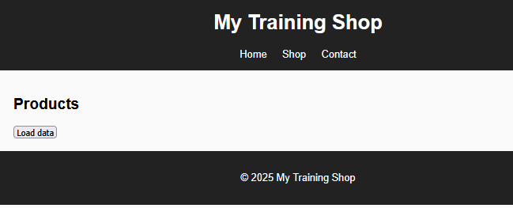

# Etape 02

## Intention

Dans ce laboratoire nous allons partir du résultat obtenu à l'[étape 01](etape-01.md), en validant notre solution en tentant de récupérer les données, non pas en local, mais à distance. Mais avant cela, nous allons nous occuper de l'événement qui permet le chargement des données.

## Objectif

Il s'agira de réussir à obtenir un résultat similaire (en terme d'affichage), à cet exemple.

<figure><figcaption></figcaption></figure>

### Tâche 001 - Charger les données à l'aide d'une action utilisateur

Actuellement notre solution lit et importe les données dès le chargement de la page "produit". Nous utilisons donc l'événement "LoadPage" initié par le navigateur.

Il s'agit d'utiliser un événement qui pourra être lancé à la demande, à l'aide d'un bouton.

En cliquant sur bouton, les données sont ensuite affichées (comme à l'étape 1).

### Tâche 002 - Vider les données

Une fois les données chargées (tâche 001), le bouton doit afficher le label "Clear data" et permettre de vider l'interface graphique.

Le résultat à obtenir et le même état que l'image présentée ci-dessus.

### Tâche 003 - Exploiter un json distant

Sans modifier la logique de votre script, utiliser le lien suivant:



Vous devriez arriver au même état que lorsque vous utilisiez le fichier local.&#x20;

Pour le valider, supprimer bien votre json local.

### Séquence à réaliser (mise à jour)

<figure><figcaption></figcaption></figure>

